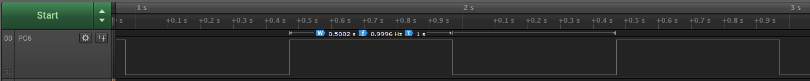

# Overflow Interrupt

This code example shows how to initialize the Real-Time Counter (RTC) with an external clock source to trigger an interrupt when the counter overflows. The interrupt is triggered every 500 ms and toggles the state of the LED.

## Related Documentation
More details and code examples on the AVR128DA48 can be found at the following links:
- [TB3213-Getting Started with Real-Time Counter (RTC)](http://ww1.microchip.com/downloads/en/Appnotes/TB3213-Getting-Started-with-RTC-DS90003213.pdf)
- [AVR128DA48 Product Page](https://www.microchip.com/wwwproducts/en/AVR128DA48)
- [AVR128DA48 Code Examples on GitHub](https://github.com/microchip-pic-avr-examples?q=avr128da48)
- [AVR128DA48 Project Examples in START](https://start.atmel.com/#examples/AVR128DA48CuriosityNano)

## Software Used
- MPLAB® X IDE 5.40 or newer [(microchip.com/mplab/mplab-x-ide)](http://www.microchip.com/mplab/mplab-x-ide)
- MPLAB® XC8 2.30 or a newer compiler [(microchip.com/mplab/compilers)](http://www.microchip.com/mplab/compilers)
- MPLAB® Code Configurator (MCC) 4.0.1 or newer [(microchip.com/mplab/mplab-code-configurator)](https://www.microchip.com/mplab/mplab-code-configurator)
- MPLAB® Code Configurator (MCC) Device Libraries 8-bit AVR MCUs 2.5.0 or newer [(microchip.com/mplab/mplab-code-configurator)](https://www.microchip.com/mplab/mplab-code-configurator)
- AVR-Dx 1.4.75 or newer Device Pack

## Hardware Used
- AVR128DA48 Curiosity Nano [(DM164151)](https://www.microchip.com/Developmenttools/ProductDetails/DM164151)

## Setup

The AVR128DA48 Curiosity Nano Development Board is used as test platform.

 

The following configurations must be made for this project:

<Configurations>

Enable the 32.768 kHz external oscillator.

RTC:
- Clock source from 32.768 kHz external oscillator with 32 DIV prescaler
- Period 500 ms
- Runs in Standby and Debug mode
- Overflow interrupt enable

Global Interrupts Enabled

| Pin |  Configuration    |
| :-: | :---------------: |
| PC6 (LED) |   Digital output  |

## Operation

1.  Connect the board to the PC.

2.  Open the Overflow_Interrupt.X project in MPLAB® X IDE.

3.  Set the Overflow_Interrupt.X project as main project. Right click on the project in the **Projects** tab and click **Set as Main Project**.

 

4.  Clean and build the Overflow_Interrupt.X project. Right click on the **Overflow_Interrupt.X** project and select **Clean and Build**.

 

5.  Select the **AVR128DA48 Curiosity Nano** in the Connected Hardware Tool section of the project settings:

- Right click on the project and click **Properties**
- Click on the arrow under the Connected Hardware Tool
- Select the **AVR128DA48 Curiosity Nano** (click on the **SN**), click **Apply** and then click **OK**:

 

6.  Program the project to the board. Right click on the project and click **Make and Program Device**.

 

## Demo

The LED pin (PC6) can be observed toggling every 500 ms.

 

## Summary

This code example shows how to enable the external clock and initialize the RTC to count and trigger an overflow interrupt every 500 ms, which toggles an LED.
